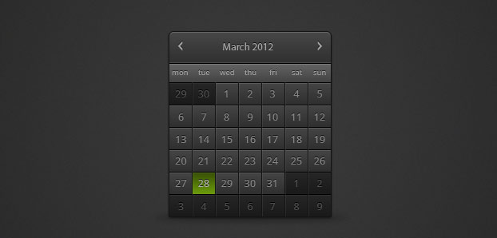

**Published** 2012-03-27

The modern day web needs layouts that can adapt to meet the growing number of devices, screen sizes and web browsers on the market. The ability to build good looking interfaces that meet this criteria is a skill to be appreciated. The idea of fluid layouts is not new, but with the implementation of an [adaptive layout](http://www.netmagazine.com/tutorials/adaptive-layouts-media-queries) you can retain more control and make design decisions based on different contexts. A user may be accessing your content via a phone, tablet or a desktop computer, and you need to consider these options when setting the constraints on your design.

To show how this can be applied to a real life situation I designed a mock-up of a calendar widget for use in this article, with the goal of implementing a HTML version of it that will adapt to different sizes and still remain usable and true to the original design. In this article I am going to use CSS3 techniques to avoid the need for images and to further improve the adaptive nature of the widget. I will be concentrating on the calendar style and structure only. A fully working calendar is definitely a project I will create in the near future.



> Original calendar design

### Semantic HTML Considerations

#### What is a calendar?

It may sound silly to question what a calendar is, but it is worth considering before building the HTML structure of the calendar widget. My calendar is a collection of numbers that represents the current month, with visual cues that hint at the days of the week along with any events that are present within that particular month.

The issue that is raised when coding in HTML is how to represent this abstract concept via code. You could use a list element, with titles and other elements to represent all the data you need to display. But when you look at the original design, it closely resembles a table element, so that is what I am going to use. Unfortunately there is no Calendar element in HTML so the table is the best semantic fit.

### The structure of the calendar

I worked out in my original design that to display all the days of a particular month within my table, then six rows are needed for the weeks. Room is left at the beginning and end to display the previous/next months days. This is dues to different months containing different totals of days. With this in mind the basic sructure of my calendar is based on this rough code:

```HTML
<div>
    <table>
        <thead>
            <tr><!--NAVIGATION ELEMENTS--></tr>
            <tr><!--DAYS OF THE WEEK--></tr>
        </thead>
        <tbody>
            <tr><!--WEEK 1--></tr>
            <tr><!--WEEK 2--></tr>
            <tr><!--WEEK 3--></tr>
            <tr><!--WEEk 4--></tr>
            <tr><!--WEEK 5--></tr>
            <tr><!--WEEK 6--></tr>
        </tbody>
    </table>
</div>
```

I have chosen to wrap the whole table in a `<div>` HTML element. This will allow me to control the width of the table, which I will explain later in my article.

With the structure of the calendar in place and any layout issues addressed I looked at the possible ways to mark up a day of the week. I considered using the `<abbr>` tag so I could display a complete date for each day on the calendar. This is a good idea, but as I have my eye on the future of the web, I decided to use the relatively new `<time>` tag from HTML5. Using this I can mark up my calendar with a human readable day of the month, but can provide a computer readable date on the time tag itself as an attribute called `datetime`. Bruce Lawson provides a great overview of the time tag in his article ‘[Marking up a blog with HTML5](http://www.brucelawson.co.uk/2009/marking-up-a-blog-with-html-5-part-2/#time)‘. This means that the calendars uses are extended as it could possibly be imported into iCal or a application like that.

Here is the structure of my days of the week:

```HTML
<td class="day"><time datetime="2012-03-01">1</time></td>
```

As you can see I have included the `datetime` attribute on the `time` element. Some may argue that the time element is unnecessary, but I feel it adds the greatest flexibility in this particular design. I have also added a class of ‘day’ so that I have a hook to style later on. The CSS I write will now bring the whole design together.

### CSS Classes

In order to style the calendar and allow it to be easily integrated into a pre-existing design I have added various CSS classes to hook onto and style. The final overall structure of the calendar with CSS classes applied looks a little like this:

```HTML
<div class="cal-container">
    <table class="cal">
        <thead>
            <tr class="cal-header"><!--NAVIGATION ELEMENTS--></tr>
            <tr class="cal-day-names"><!--DAYS OF THE WEEK--></tr>
        </thead>
        <tbody>
            <tr class="week"><!--WEEK 1--></tr>
            <tr class="week"><!--WEEK 2--></tr>
            <tr class="week"><!--WEEK 3--></tr>
            <tr class="week"><!--WEEk 4--></tr>
            <tr class="week"><!--WEEK 5--></tr>
            <tr class="week"><!--WEEK 6--></tr>
        </tbody>
    </table>
</div>
```

This will allow me to target all the elements I require and retain maximum control. I will now break down the inner elements of the different parts of the calendar starting with the `cal-header` which I have contained in the `<thead>` section of the table.

```HTML
<tr class="cal-header">
    <th><a href="#" class="cal-nav prev" title="Previous month"><</a></th>
    <th colspan="5" class="cal-title">March 2012</th>
    <th><a href="#" class="cal-nav next" title="Next month">></a></th>
</tr>
```

The `cal-header` contains the navigational elements of the calendar which in a complete example would allow the user to navigate to the previous/next months. A fully working calendar is beyond the scope of this article, and is something I will return to another time. I have used two `anchor` elements to provide the required buttons. The center title has been coded to span the five remaining table cells, as there are seven columns in the table. Instead of using images for the previous/next symbols, I have used the greater than and less than characters. This will allow these characters to scale with the calendar as it changes size therefore leveraging the power of typography.

```HTML
<tr class="cal-day-names">
    <th abbr="Monday">mon</th>
    <th abbr="Tuesday">tue</th>
    <th abbr="Wednesday">wed</th>
    <th abbr="Thursday">thu</th>
    <th abbr="Friday">fri</th>
    <th abbr="Saturday">sat</th>
    <th abbr="Sunday">sun</th>
</tr>
```

The day’s name makes use of the `abbr` attribute. This allows the full names to be referenced by screen readers for greater levels of accessibility. I do my utmost to provide a fallback for users with disabilities. I can target the names via the `cal-day-names` class and style them differently in my CSS.

```HTML
<tr class="week">
    <td class="oom"><time datetime="2012-02-27">27</time></td>
    <td class="oom"><time datetime="2012-02-28">28</time></td>
    <td class="oom"><time datetime="2012-02-29">29</time></td>
    <td class="day"><time datetime="2012-03-01">1</time></td>
    <td class="day"><time datetime="2012-03-02">2</time></td>
    <td class="day"><time datetime="2012-03-03">3</time></td>
    <td class="day"><time datetime="2012-03-04">4</time></td>
</tr>
```

I have used two different classes for the days of the week, those are `oom` and `day`. OOM is an abbreviation of ‘out of month’, which refers to the days that appear on the calendar from the previous and following month to the one which is the focus.

Finally the calendar has all it’s classes worked out and the structure has been set. Now it is just a matter of styling it.

### CSS3 Techniques

#### A note on web browser prefixes

As I have set out to build this calendar using no images, all of the gradients and shadows are going to be achieved using CSS3 techniques. CSS3 should be used with vendor prefixes to allow modern web browsers to render the design properly. To allow my CSS code in this demo to be more succint I have chosen to make use of [Lea Verou’s Prefix Free javascript plugin](http://leaverou.github.com/prefixfree/). This parses my CSS and adds in the relevent vendor prefixes at runtime, allowing me to write the CSS once, rather than multiple times. It is not a necessity to use this plugin you would simply need to add the browser-prefixes in yourself.

#### Shadows & Rounded Corners

The top of the table has rounded corners on the left and right hand sides. To achieve this you need to not only round the table corners, but also the table cells that occupy the same corners. In this design that will be the two cells that contain the navigation elements.

Here is the CSS I am using to achieve this effect:

```CSS
.cal {
    border-radius: 10px 10px 0 0;
    border-spacing: 0;
    box-shadow: 0 0 5px rgba(0,0,0,0.3);
    border: 1px solid rgb(20,20,20);
}
.cal-header th:first-child {
    border-radius: 10px 0 0 0;
}
.cal-header th:last-child {
    border-radius: 0 10px 0 0;
}
```

The secret here to forcing the CSS to produce the desired effect is to set `border-spacing: 0` on the table (.cal). Do not use `border-collapse: collapse` as it makes the ugly corners re-appear. I set a border around the table and add the CSS3 `box-shadow` property to give the subtle shadow around the calendar.

To target the navigation cells I use the first/last-child pseudo selectors and then set the border-radius on those elements.

#### Gradients

Linear gradients are used multiple times throughout this calendar. They are necessary to give the shape and depth that adds to the overall design. To achieve this effect a few years ago you would have had to resort to images, creating them in your design program of choice and outputting them for the web. CSS3 linear gradients provide a modern alternative that fits in with this articles ethos, which is one of adaptation. I will focus in on the gradient used in the ‘cal-header’.


```CSS
.cal-header th {
    background-image: linear-gradient(rgb(70,70,70), rgb(49,49,49) 50%);
}
```

In the above code example, I have set a linear-gradient for the table cells in the .cal header row. The colour values specify a medium grey, rgb(70,70,70) to a darker grey, rgb(49,49,49). I have not put a direction in for the gradient, so it runs from top (first colour value) to bottom (second colour value). The 50% at the end denotes a colour ‘stop’. The colours specified will blend at 50% of the height of the object. This means that the object can change height and the linear-gradient will respond accordingly, redrawing and filling the new object height. That was something that images could not do.

#### Double border bevel effect

To give my table cells a bevelled effect I tried various different techniques. The main difficulty being that you can not set two borders on a single object. I tried using padding, pseudo-elements and finally I used a simple trick.

```CSS
.cal td {
    border-top: 1px solid rgb(20,20,20);
    border-left: 1px solid rgb(20,20,20);
}
.day {
    box-shadow: 0 1px 0 rgba(255,255,255,0.15) inset, 1px 0 0 rgba(255,255,255,0.15) inset;
}
```

I first gave all the td cells in my table a border top and left. This gives the dark border that seperates all the table cells. Then a box shadow is applied to these same cells. The significant advantage of the box shadow is that it can accept multiple values, and is rendered seperately to an object’s borders. Thus I can give it a value for the top and left of the table cell, and it gives them a white highlight. I have used RGBA values for the box shadow to control the colours opacity. This helps to reduce the harshness of the effect and give it a subtle appearance.

### Adaptive Layout

To set the calendar up for a layout that adapts I set some properties on the `cal-container` to force it to contain the calendar. This will ultimately control the width and height of elements within the calendar. I am aiming for a mobile-first strategy, so the initial width will be 250 pixels. As I want the design to be fluid and be able to adapt to different situations I calculate the width and specify it in ems. So I take the desired width of 250 pixels and divide it by the initial font-size, which I have set explicitly at 16 pixels.

```CSS
.cal-container {
    width: 15.625em; /* 250(target size) / 16 = 15.625 */
    height: 16.25em; /* 260(target size) / 16 = 16.25 */
}
.cal {
    width: 100%;
    height: 100%;
    font-size: 81.25%; /* Table base font {13/16*100} = 81.25% */
}
```

I also perform the same calculation to control the height of the calendar. The calendar table element must now be set to fill it’s container via the use of percentages.

This is the key to my adaptive layout, as the table will always fill it’s parent container. The container’s width and height is what will change with `media-queries` in my CSS. The final value that affects the layout of the table is the overall font-size. As I am designing first for smaller screens that are primarily on mobile devices, I can afford to use a smaller font-size in this situation. The overall font-size is reduced by a percentage value of 81.25%. This will set a base font size of 13px for the table. This will allow all of the `em` values I set on various elements to scale predictably.

### Media-queries & Breakpoints

Finally we need to make use of `media-queries` to set different values that are dependent on the web browser window size. I have primarily used common values based on smartphones, tablets, netbooks and desktops. The variety will allow the calendar to adapt nicely to most given situations. When using `media-queries` it is best practice to aim for the lowest common denominator on whatever devices you are targeting. If you get too tied up in designing for every [possible screen size](http://www.zeldman.com/2011/12/29/state-of-the-web-of-apps-devices-and-breakpoints/), it will frankly send you mad!

Here are the `media-queries` I have used in this demo:

```CSS
/* SMARTPHONE LANDSCAPE 480px */
@media only screen and (min-width: 30em) {
    .cal-container {
        width: 20em; /* 320px */
        height: 18em; /* 288px */
    }
    .cal {
        font-size: 87.5%; /* 14px */
    }
}
/* TABLET 768px */
@media only screen and (min-width: 48em) {
    .cal-container {
        width: 20em; /* 320px */
        height: 21.875em; /* 350px */
    }
    .cal {
        font-size: 100%; /* 16px */
    }
}
/* NETBOOK 1024px */
@media only screen and (min-width: 64em) {
    .cal-container {
        width: 26.5em; /* 424px */
        height: 29em; /* 464px */
    }
    .cal {
        font-size: 112.5%; /* 18px */
    }
}
/* DESKTOP 1600px+ */
@media only screen and (min-width: 100em) {
    .cal-container {
        width: 33.125em; /* 530px */
        height: 35em; /* 560px */
    }
    .cal {
        font-size: 125%; /* 20px */
    }
}
```

As you can see I have made subtle changes to the `.cal-container` width and height dependent on the width of the window. The variations allow the calendar to maintain a usable interface at all times. I have set the width/height in `em` values to maintain a flexible system that is all based on the overall font-size of the document.

The font-size of the calendar changes to accomodate larger screens, thus allowing a high level of readability. As no images have been used at all, all of the effects scale accordingly and never break the visual look of the calendar. This is great for site optimisation and maintenance.

### Wrap up

Please view the demo and adjust your web browser’s window size. You will see the calendar change accordingly.

**Please note that this calendar is not backwards compatible in its current state, I have chosen to support modern browsers only in my demo. It is possible to build a fallback, but that is outside the scope of this article. Internet Explorer does not support many of the effects I have used without javascript polyfills.**

- [View demo](https://freemagee.github.io/adaptive-layout-calendar/)
